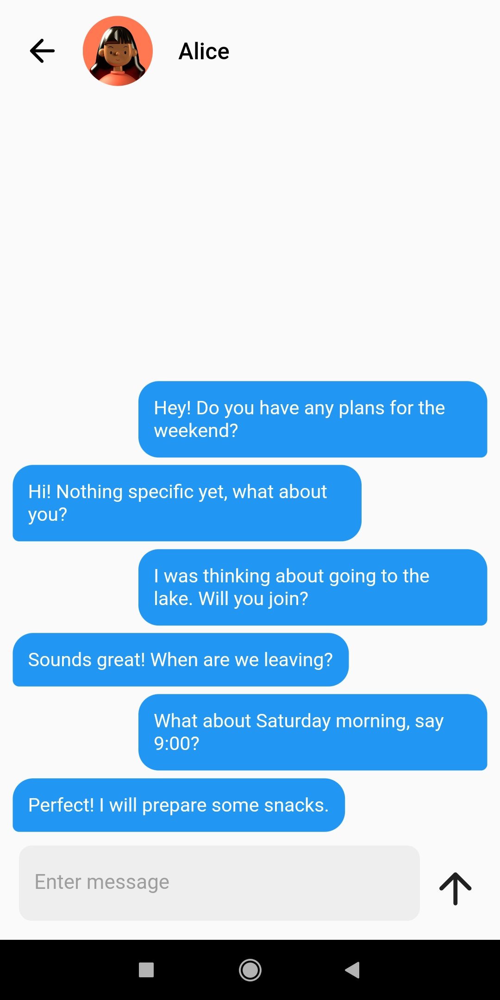

# Buzz

Buzz is a modern chat app written in Flutter that allows users to use it in real-time. Users can register and log in using Firebase Authentication, ensuring secure and simple account management. The application uses Firebase Firestore to store user messages and data, which ensures quick access to information.

## Functions

- **Registration and Login**: Secure login with Firebase Authentication.
- **Sending and receiving messages**: Communicate while using Firebase Firestore.
- **Friendly interface**: Intuitive and responsive design with Flutter.
- **Multiplatform**: Works on Android and iOS.

## Technology

- **Frontend**: Fluttering
- **Backend**: Firebase (authentication, Firestore, cloud functions)
- **Languages**: Dart

## Installation

1. Cloning the repository:
 ```sh
 git clone https://github.com/sqrasdf/buzz
 cd buzz
 ```

2. Dependent installation:
 ```sh
 flutter get pub
 ```

3. Launching the application:
 ```sh
 flutter run
 ```

## Screenshots

### Welcome screen and Menu page
<p float="left">
  
  
</p>

### Chat page and Profile page
<p float="left">
  
  
</p>

